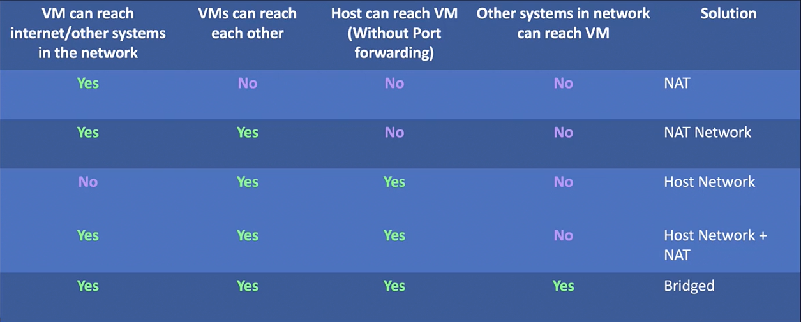

# Multiple VMs

- We can create multiple VMs in VirtualBox by cloning the existing VM.
  - Full clone: The full clone is an independent VM. The full clone has its own virtual disk.
  - Linked clone: The linked clone is a dependent VM. The linked clone uses the virtual disk of the parent VM.
    

## Snapshot

- We can create a snapshot of the VM. The snapshot is a copy of the VM at a specific point in time.
- We can revert to the snapshot if something goes wrong.
- We can clone the snapshot to create a new VM.
